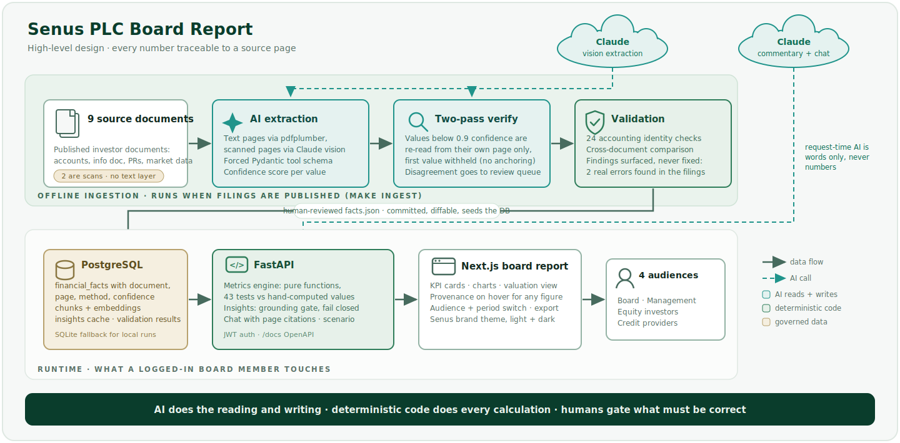

# Senus PLC Board Report


**Assiduous Technology Graduate Assessment · Aniket Nimbalkar**

A platform that reads Senus PLC's published investor documents, extracts the financial
information into a PostgreSQL database using Claude vision with structured output,
computes the board metrics with a deterministic (non-AI) metrics engine, and presents
the result as an interactive board report for four audiences: Management, the Board,
Equity Investors and Credit Providers.

- **Repo:** https://github.com/ANIKET2703/senus-board-report
- **Live demo:** https://senus-board-report-aniket.vercel.app
- **Demo video:** _[YouTube link]_
- Demo login: `ceo@senus.com` / `senus2030`

---

## The core design decision

**AI does the reading and the writing. Deterministic code does every calculation.**

LLMs are good at reading scanned financial statements and writing commentary, and not
reliable at arithmetic. So the boundary is strict:

| Stage | Owner | Why |
|---|---|---|
| Scanned/text PDF to structured line items | Claude (vision + tool-use structured output) | The two most important source documents are scanner images with zero extractable text |
| Line items to validated facts | Deterministic Python (accounting identities) | Balance sheets must balance, no judgement involved |
| Facts to metrics (EBITDA, DSCR, ROCE, runway, FCF bridge) | Pure-function metrics engine, 43 unit tests | Financial calculations must be exact and auditable |
| Metrics to narrative commentary | Claude, grounded only on validated facts | Every numeric claim is checked against the database before display; anything untraceable is rejected |
| Q&A ("Ask the Board Pack") | Retrieval over source docs + validated metrics | Answers cite document and page |

## Architecture



Sequence diagrams for the two critical flows (grounded commentary, two-pass extraction),
the ERD and the key technical decisions: [`docs/ARCHITECTURE.md`](docs/ARCHITECTURE.md).

## What stands out

1. **Provenance everywhere.** Hover any figure in the P&L, balance sheet or cash flow
   tables: it shows the source document, page, extraction method (vision vs text layer)
   and confidence. The Documents page lists every fact per document.
2. **The validation layer caught two real errors in Senus's published documents:**
   - HY26 results PR: HY25 comparative gross profit is stated as 272,331, but
     revenue minus cost of sales is 271,331 (a EUR 1,000 tie-out difference).
   - The same PR states Loamin goodwill as 669,500 in the notes but 669,550 in the
     balance sheet.
   These show up in the app as data-quality findings. The pipeline records values
   exactly as printed and flags inconsistencies instead of silently fixing them.
3. **Honest finance on a pre-profit micro-cap.** DSCR is -50.3x at FY25 and is shown
   with a plain caveat (debt service is equity-funded until the FY2028 EBITDA-positive
   guidance) rather than suppressed. At HY dates scheduled principal isn't disclosed,
   so DSCR is suppressed with the reason instead of being computed interest-only (which
   would print a meaningless -340x). Same honesty for ROCE and gearing on negative
   equity. There are no MoM views because Senus publishes no monthly data; that gap is
   recorded as a finding instead of being filled with invented numbers.
4. **Audience toggle.** Credit providers land on solvency and runway first; equity
   investors on growth and the Senus 2030 trajectory. Same validated facts, four lenses.
5. **Senus 2030 scenario model.** The company's public commitment (revenue CAGR of at
   least 50%, EBITDA-positive during FY2028) as an interactive model with explicit,
   adjustable assumptions, and a frank note that HY26 actual growth (4.1%) is far below
   that trajectory.
6. **Valuation & Market view.** SENUS trades at EUR 6.15 (up 19.98% on the EUR 5.126
   admission price). Market cap, EV and EV/LTM-revenue are computed from fact-store
   values only — shares and admission price from the Direct Listing press release
   (p.3), prices from the Euronext market-data exports, net debt from the HY26 balance
   sheet — and the page says plainly that a zero-volume Access-market quote is
   indicative. Cross-checks tie shares x admission price to the disclosed EUR 13.13m
   admission market cap, and the 52-week move to close/admission.

## Tech stack

| Layer | Choice | Rationale |
|---|---|---|
| Backend | Python 3.12 · FastAPI · SQLAlchemy 2 | Python owns the AI/data pipeline; FastAPI gives typed, self-documenting APIs (`/docs`) |
| Frontend | Next.js 14 · TypeScript · Tailwind · Recharts | Modern typed React; App Router; composable charts |
| Database | PostgreSQL (SQLite fallback for zero-config local runs) | Relational facts now; pgvector is the scale-up path for retrieval |
| AI | Claude (vision extraction, commentary, chat) · fastembed local embeddings · BM25 fallback | One AI vendor; local embeddings avoid a second API dependency for a 7-document corpus |
| Infra | Docker Compose · GitHub Actions CI (lint, type-check, tests, fact validation) | Reproducible dev env; every push re-validates the accounting identities |

## Running it

```bash
# full stack (Postgres + API + web)
cp .env.example .env          # add ANTHROPIC_API_KEY to enable AI features
docker compose up --build
# -> http://localhost:3000  (login: ceo@senus.com / senus2030)

# or without Docker:
cd backend && pip install -e ".[dev]" && uvicorn app.main:app --reload   # API on :8000 (SQLite)
cd frontend && npm install && npm run dev                                 # web on :3000

# tests (43, all passing)
cd backend && python -m pytest tests/ -v

# re-run the AI extraction pipeline against the source PDFs (~$1-2 API cost)
export ANTHROPIC_API_KEY=sk-ant-...
cd backend && python -m pipeline.run --extract && python -m pipeline.run --validate
```

The app boots and seeds **without any API key**: validated extraction output is
committed as a versioned fixture (`data/extracted/facts.json`), so deployments are
deterministic and every number is diffable in code review. With a key, AI commentary,
chat and re-extraction activate; commentary is generated once per audience/section and
cached in the database, so repeat views cost nothing.

## How I validated the outputs

1. **Human baseline first.** Before building the pipeline I read every source document
   and recorded each figure with its page reference in
   [`docs/FINANCIAL_FACTS.md`](docs/FINANCIAL_FACTS.md).
2. **Deterministic identity checks** (24 accounting identities): balance sheet balances;
   closing cash on the cash-flow statement ties to balance-sheet cash; opening cash ties
   to prior-period closing; gross profit equals revenue minus cost of sales; customer
   channel counts sum to the stated total; loan maturity buckets sum to balance-sheet
   bank debt; shares x admission price ties to the disclosed admission market cap; the
   52-week price move ties to the admission price. Run them yourself:
   `python -m pipeline.run --validate`. A 25th check records a disclosure-coverage
   finding: Senus publishes no monthly data, so MoM views are absent by design.
3. **Two-pass extraction verification.** Any value extracted below 0.9 confidence is
   re-read independently from its own page at higher resolution, with the first value
   withheld so the second read is not anchored. Two agreeing reads raise confidence;
   disagreement sends the fact to a human review queue (Documents page,
   `/api/validation/review-queue`) and keeps it out of commentary until signed off.
4. **Unit tests against hand-computed values**, for example FY25 EBITDA (-613,313), the
   FY25 FCF bridge tying to the published cash-flow statement (-378,271), HY26 runway
   (10.5 months), DSCR, ROCE, LTM revenue (850,873).
5. **Cross-document consistency.** FY25 figures appear in both the ADF audited accounts
   and the Information Document; both were extracted and compared.
6. **AI commentary grounding check.** Generated text is scanned for numeric claims; any
   number not traceable to a validated fact or metric rejects the output.
7. **The validation works against real vision errors.** In the live extraction run (raw
   outputs committed in `data/extracted/raw/`), Claude vision misread one digit on the
   scanned FY25 accounts: revenue as 838,991 instead of 836,991, at 0.95 confidence.
   The gross-profit tie-out check and the cross-document comparison both catch it; the
   validated store carries the correct value. A 95%-confident wrong number is exactly
   what an unvalidated AI pipeline would ship.

## Development workflow

I read all seven filings myself before writing code: docs/FINANCIAL_FACTS.md is my
hand-checked baseline with page references, and it predates the pipeline. The
architecture and every technical decision are mine, written up with their reasoning in
docs/ARCHITECTURE.md. As the brief invites, AI tooling was part of the development
toolchain (code scaffolding, test boilerplate); everything it touched was reviewed by
me, and every financial figure was verified by me against the source PDFs. The finished
product uses the Claude vision API for extraction because two key filings are scanned
images with no text layer; that is a product requirement, not a development shortcut.
I can walk through and defend any file in this repository.

## Assumptions

- FY24/FY25 figures are the consolidated ADF Farm Solutions Ltd audited accounts, the
  operating group that became Senus PLC in the pre-listing reorganisation (Information
  Document section 3). HY26's restated equity reflects that reorganisation and is
  flagged in-app rather than force-reconciled.
- EBITDA is reconstructed as operating result plus depreciation/amortisation (FRS 102
  small-company accounts do not present it).
- FCF is defined pre-financing (operating plus investing cash flow), the credit-provider
  view.
- Cash runway uses average monthly pre-financing burn for the most recent period and
  excludes future fundraising.
- Customer and channel KPIs are FY25 disclosures from the Information Document. Senus
  does not publish monthly data, so MoM views are not built; the gap is surfaced as a
  data-quality finding.
- Valuation uses the latest Euronext market-data exports (data/market/, loaded as
  printed with provenance, not AI-extracted) and the HY26 balance sheet for net debt.
  SENUS shows zero reported volume in the sampled window, so the quoted price is
  indicative and the Valuation page carries that caveat on every output.
- Auth is demo-grade (JWT, seeded user) by design; a production build would add SSO/MFA,
  rate limiting and secrets management.

## Repository layout

```
backend/
  app/            FastAPI: api/ core/ models/ services/ (metrics_engine, insights, rag, scenario)
  pipeline/       AI ingestion: extract (Claude vision + two-pass verify) · validate · load · embed
  tests/          43 tests: metrics vs hand-computed values, valuation, validation, API e2e
frontend/
  src/app/        login + dashboard routes (overview, growth, profitability, cash,
                  solvency, returns, valuation, scenario, documents, chat)
  src/components/ MetricCard, InsightCard, ProvenanceTable
data/
  source_documents/  the published Senus/ADF filings (inputs)
  market/            Euronext price exports behind the Valuation view (loaded as printed)
  extracted/         versioned, human-validated pipeline output (facts.json + raw runs)
docs/
  ARCHITECTURE.md    system design, ERD, key decisions, extraction methods considered
  FINANCIAL_FACTS.md human-verified baseline with page references
  ONE_PAGE_WRITEUP.md the one-page submission write-up
```
