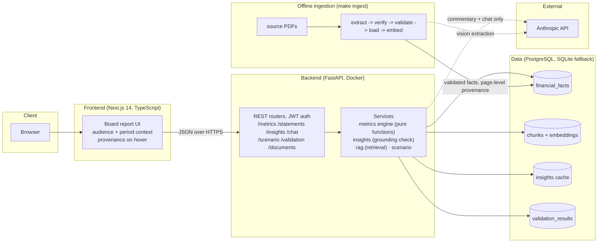
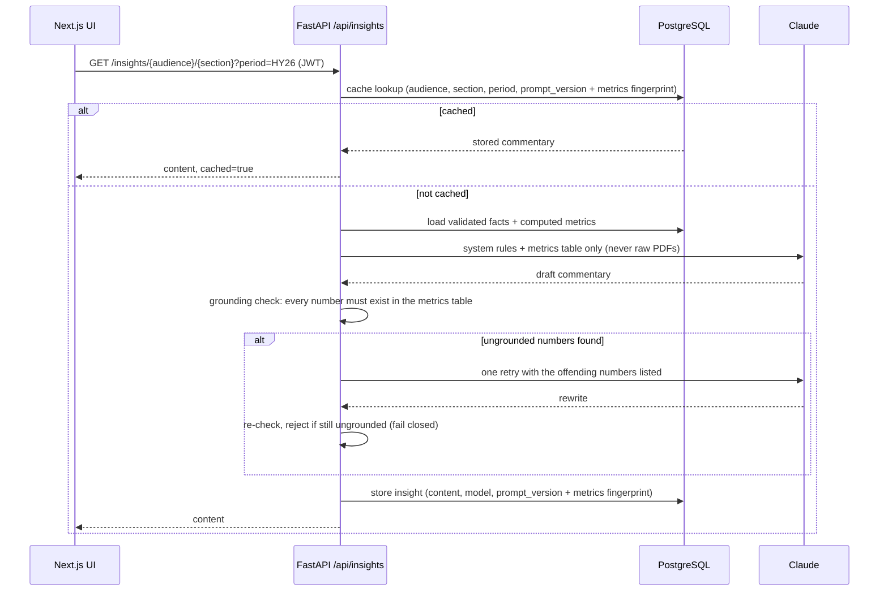
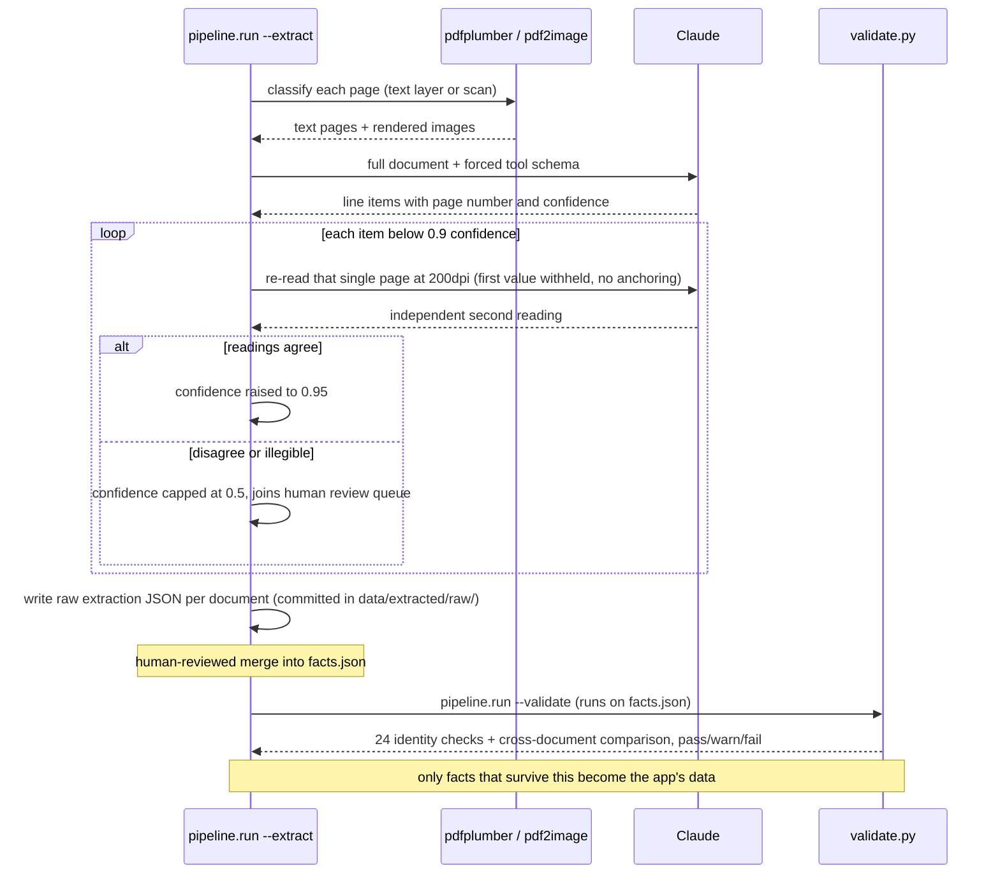
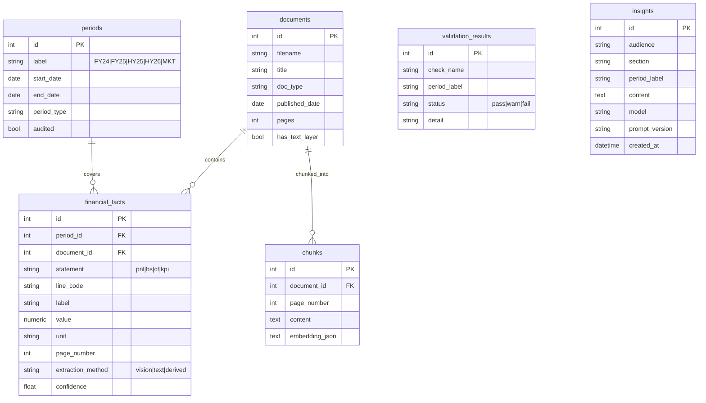

# Architecture and technical decisions

## What this is

A platform that reads Senus PLC's published investor documents, extracts the financial
data into a database using Claude vision with structured output, runs deterministic
validation and metric calculations on top, and presents the result as an interactive
board report for four audiences: Management, the Board, Equity Investors and Credit
Providers.

## Core design principle: AI does the reading and writing, deterministic code does every calculation

LLMs are good at reading scanned financial statements and writing commentary. They are
not reliable at arithmetic. So the boundary between the two is hard:

| Layer | Who does it | Why |
|---|---|---|
| Document to structured line items | Claude (vision + forced tool schema) | Two key source docs are scanned images with no text layer |
| Line items to validated facts | Python validation (accounting identities) | Balance sheets must balance, no judgement involved |
| Facts to metrics (margins, DSCR, ROCE, runway) | Pure Python functions, unit tested | Financial calculations must be exact and reproducible |
| Metrics to narrative commentary | Claude, given only validated metrics | Writing is the model's job; a post-check rejects any number not in the metrics table |
| Q&A ("Ask the Board Pack") | Retrieval over doc chunks, answers cite document + page | Keeps answers grounded in the filings |

## High-level design (HLD)


<!-- container detail retained below the illustration -->
<details>
<summary>Text version of the container view</summary>



</details>

Two boundaries matter. Ingestion runs offline, not at request time: filings change
quarterly, so validated output is committed as JSON and the app boots and seeds with no
API key. And the Anthropic API sits behind dotted lines only: request-time calls happen
just for commentary and chat, never for numbers.

## Key technical decisions

1. **FastAPI + Next.js + PostgreSQL + Docker.** Standard fintech stack. Python owns the
   AI and data pipeline, typed React owns the UI. SQLite fallback means anyone can run
   the repo with zero setup.

2. **Extraction is an offline pipeline, not a request-time call.** Filings change
   quarterly, not per request. Extracted and validated output is committed as versioned
   JSON (`data/extracted/`), so deployments are deterministic and every number shows up
   in a git diff. `make ingest` re-runs the pipeline when new filings land.

3. **Vision extraction is a hard requirement in this dataset.** The two most important
   documents (the ADF FY25 audited accounts and the Senus Limited balance sheet) are
   scanner images with zero extractable text, so there is no way to get their numbers
   programmatically without a vision model. The pipeline checks each page for a text
   layer and routes it accordingly.

4. **Every fact carries provenance.** Each `financial_facts` row stores source document,
   page number, extraction method and confidence. The UI shows this on hover for any
   figure. That is what makes the numbers defensible in front of a board or an auditor.

5. **Validation is deterministic and visible.** Balance sheet balances, cash flow ties
   to balance sheet cash, gross profit equals revenue minus cost of sales, cross-period
   cash continuity, customer counts sum to the stated total, loan maturity buckets sum
   to balance-sheet bank debt, and the admission market cap ties to shares x admission
   price across two independent sources. Failures are not hidden;
   they appear in the app as data-quality findings. The source documents contain two
   real inconsistencies the pipeline caught: a EUR 1,000 gross profit tie-out difference
   in the HY25 comparatives and a EUR 50 goodwill discrepancy in the HY26 PR. A further
   finding records that Senus publishes no monthly data, which is why there are no MoM
   views: they cannot be built from source without inventing numbers.

6. **Metrics engine is pure functions with unit tests.** EBITDA, the FCF bridge, runway,
   DSCR, ROCE, working capital, growth rates and the valuation view (market cap, EV,
   EV/revenue on the guidance path) are computed from validated facts and asserted
   against hand-computed values (43 tests). On a pre-profit company some textbook ratios
   mislead, so metrics carry explicit caveats (negative DSCR means debt service is
   currently equity-funded). Where an input is not disclosed at all — HY balance sheets
   don't split creditors by maturity, so HY debt service is unknowable — the ratio is
   suppressed with the reason rather than computed from a partial denominator.

7. **Local embeddings, BM25 fallback.** The corpus is 7 documents. A hosted embedding
   API would add a second vendor for no gain at this size. Vectors are stored as JSON
   and compared in Python; if fastembed is not installed, retrieval falls back to BM25.
   At real scale this becomes pgvector with an HNSW index, which is why Postgres was
   chosen in the first place.

8. **Commentary is generated from validated facts only, cached in the DB, versioned by
   prompt.** The model receives the computed metrics table, never raw PDFs. After
   generation, every number in the output is checked against the table. If a number
   cannot be traced, the commentary is rejected (one retry, then fail closed).

9. **Audience-aware presentation.** Same facts, four lenses. Credit providers land on
   solvency and runway, investors on growth and the Senus 2030 model. A board report is
   a communication tool, not a data dump, and the audiences read it differently.

10. **Auth is demo-grade on purpose** (JWT, one seeded user). It shows the pattern; a
    real deployment would add SSO, MFA and rate limiting, and that is stated in the
    README rather than half-implemented here.

## Extraction methods: what is implemented and what was considered

The brief asks for AI methods to extract financial information from the source
documents. The choices, and the options rejected, with reasons:

**Implemented**

| Method | Where | Why |
|---|---|---|
| Text-layer extraction routed to Claude with a forced tool schema | `pipeline/extract.py` | Cheapest reliable channel when a text layer exists |
| Claude vision on rendered pages | `pipeline/extract.py` | The key documents are scans; OCR-free vision reading with structured output |
| Structured output via forced tool_use | `pipeline/schemas.py` | Malformed extraction is rejected at the schema boundary |
| Per-value confidence scores | schema field | The model flags blurry or ambiguous values itself |
| Two-pass verification of low-confidence values | `verify_low_confidence()` in `pipeline/extract.py` | Values below 0.9 confidence are re-read independently from their own page at 200dpi. The first value is withheld so the second read is not anchored. Agreement raises confidence, disagreement sends the fact to the review queue |
| Deterministic accounting-identity validation | `pipeline/validate.py` | 24 identity checks + a disclosure-coverage finding, no AI judgement |
| Cross-document comparison | pipeline + manual merge | FY25 appears in two filings; comparing them caught a live one-digit vision misread (838,991 vs 836,991) |
| Human review queue | `/api/validation/review-queue` + Documents page | Facts below 0.9 confidence are excluded from commentary until a person signs them off |

**Considered, not adopted**

| Method | Why not |
|---|---|
| Classical OCR (Tesseract) as a second non-LLM witness | Adds a system dependency for little gain over two-pass verification plus identity checks on a 7-document corpus. The right next step at scale |
| Extract everything twice and diff (self-consistency) | Doubles API cost. Two-pass verification targets the same risk where it concentrates: low-confidence values |
| Anthropic native PDF input with citations | Attractive for text documents, but the scanned filings still need the image path, so the pipeline would split in two |
| Bounding-box provenance (click to highlight the value on the page) | Good demo feature, deferred for scope. Page-level provenance already covers the audit need |

## Known limitations, and what I would do next

Written down on purpose: knowing where the edges are is part of standing over the work.

- The commentary grounding check compares numeric tokens, not meaning. A wrong sentence
  built from correct numbers would pass it. The production version makes the model emit
  claim-to-fact-key pairs and verifies each reference, not just the digits.
- ~~The insight cache invalidates only when `prompt_version` is bumped.~~ Fixed: the
  cache key now includes a fingerprint (SHA-256 prefix) of the metrics table, so any
  change to the underlying facts invalidates cached commentary automatically.
- Schema is created with SQLAlchemy `create_all`. A real deployment needs Alembic
  migrations from day one.
- Auth is demo-grade: JWT with one seeded user, token in localStorage, no rate limiting.
  Production gets SSO/MFA, httpOnly cookies and login throttling.
- Extraction runs as a CLI, which is right for 7 documents. At scale it becomes an
  event-driven job (queue plus workers) triggered by new filings, with the review queue
  gating publication.
- Monitoring worth adding before real users: grounding-failure rate, extraction
  confidence distribution, and identity-check pass rate per document version.

## Repository layout

```
senus-board-report/
├── backend/
│   ├── app/
│   │   ├── api/            # routers: metrics, statements, insights, chat, documents, scenario, validation, valuation, auth
│   │   ├── core/           # config, db, security
│   │   ├── models/         # SQLAlchemy models
│   │   ├── services/       # metrics_engine, insights, rag, scenario, llm
│   │   └── main.py
│   ├── pipeline/           # extract, validate, load, embed
│   ├── tests/              # 43 tests against hand-computed values
│   └── pyproject.toml
├── frontend/
│   ├── src/app/            # Next.js App Router pages
│   ├── src/components/     # MetricCard, InsightCard, ProvenanceTable
│   └── src/lib/            # api client, audience/period/theme contexts
├── data/
│   ├── source_documents/   # the published Senus/ADF filings (inputs)
│   ├── market/             # Euronext price exports behind the Valuation view
│   └── extracted/          # versioned pipeline output (facts.json + raw per-document runs)
├── docs/                   # this file, FINANCIAL_FACTS.md, ONE_PAGE_WRITEUP.md, diagrams/
├── docker-compose.yml
├── Makefile
└── README.md
```

## Low-level design (LLD)

Sequence diagrams for the two flows that carry the most risk, then the data model.

### Sequence: commentary generation with the grounding gate



### Sequence: extraction with two-pass verification



### Data model (ERD)


